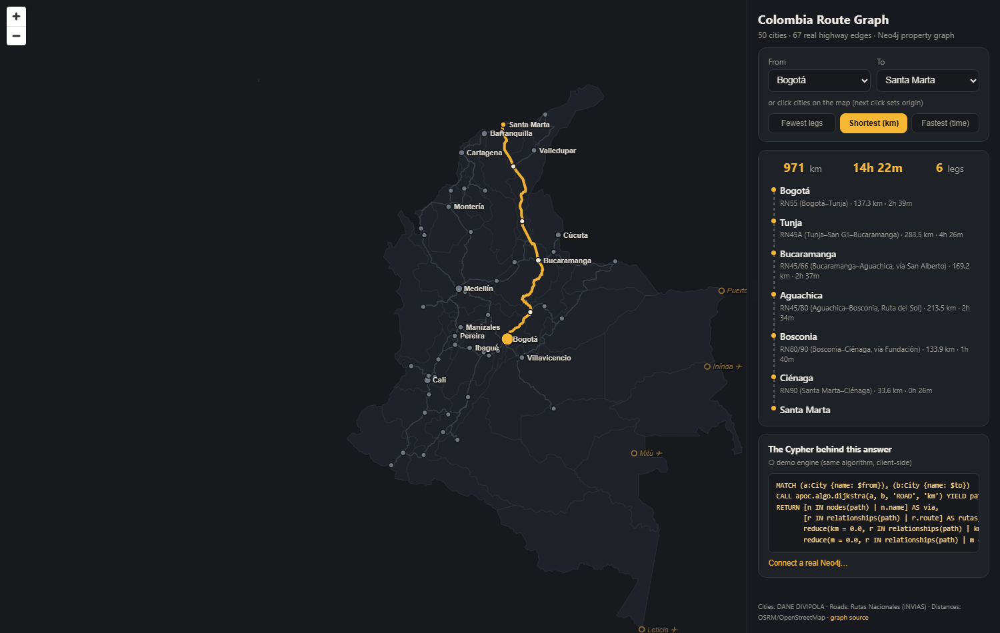

# 🗺️ routegraph-web

**Interactive explorer for the Colombian road graph** — shortest paths over
real highways, with the Cypher always visible. Data + Neo4j schema:
[`routegraph-db`](https://github.com/jonathanDavid/routegraph-db).



## What it shows

Pick two cities (dropdowns or click the map) and a question — **fewest legs**,
**shortest km**, or **fastest time** — and the route lights up with per-leg
detail (real Ruta Nacional names, OSRM km/min). The panel always shows **the
Cypher that answers the question**, because the point is teaching why a graph
database fits routing.

## Two engines, one answer

- **Demo engine (default, key-less):** client-side Dijkstra over the exported
  graph JSON — this is what the deployed site runs, no backend, no keys.
- **Live Neo4j:** enter a bolt URI (local Docker or Aura) in the connection
  panel and the SAME Cypher runs for real over bolt-in-WebSocket, straight
  from the browser — no API server. Credentials live only in your
  localStorage. Tests pin both engines to identical answers
  (Bogotá→Santa Marta = the real Ruta del Sol via Aguachica–Bosconia–Ciénaga, 971 km). The four Amazon-basin capitals (Leticia, Mitú, Inírida, Puerto Carreño) appear as roadless ✈ nodes — routing to them explains honestly that no road exists.

## Run it

```bash
npm install
npm run dev      # demo mode works immediately
npm test         # 7 tests: corridor pins, mode divergence, symmetry, reachability, leg sums

# optional live mode:
#   in routegraph-db:  docker compose up -d && NEO4J_PASSWORD=routegraph npm run seed
#   then "Connect a real Neo4j…" in the UI → bolt://localhost:7687 / neo4j / routegraph
```

## Stack

React + Vite + TypeScript · MapLibre GL (key-less, no tile server — the graph
IS the map) · neo4j-driver (browser, bolt-in-WebSocket) · Vitest.
